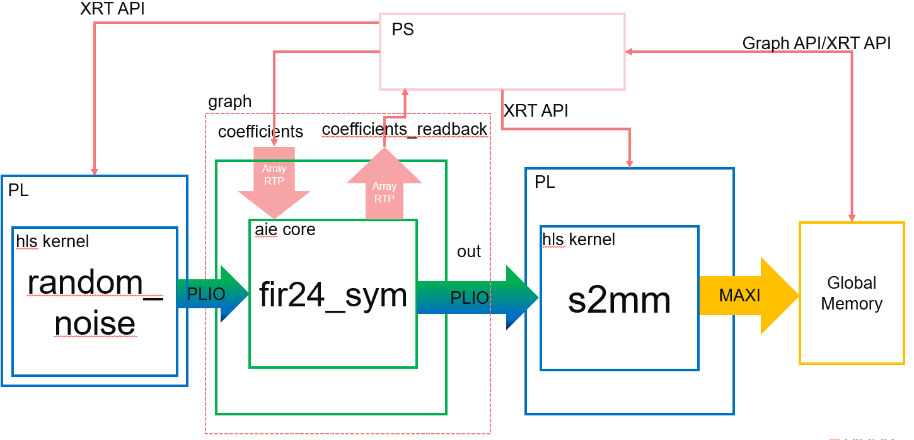

<table>
 <tr>
   <td align="center"><h1>AI Engine Runtime Parameter Reconfiguration Tutorial</h1>
   </td>
 </tr>
 <tr>
 </td>
 </tr>
</table>

## Asynchronous Array RTP Update and Read for AI Engine Kernel
This step demonstrates:

  * The Array RTP update for AI Engine kernels
  * Asynchronous read of Array RTP for AI Engine kernels
  * C++ version of XRT API to control PL kernels

The example design is similar to [Asynchronous Update of Scalar RTP for PL inside a Graph, and Array RTP Update for AI Engine Kernel](./step4_async_pl_scalar_aie_array.md), except that the AI Engine kernel has an asynchronous output, and the PL kernel inside the graph is pulled out of the graph. The example shows how to perform asynchronous reads of array RTP by the ADF API and the XRT API. Also, the PL kernels are controlled by the C++ version of the XRT API, which is different from the previous steps by OpenCL API or C version of XRT API.

The system to be implemented is as follows:

__Note__: The default working directory in this step is "step5", unless explicitly specified otherwise.

### Review Graph and RTP Code
In the AI Engine kernel code (`src/kernels/hb24.cc`), the interface is declared as:

    void fir24_sym(input_window_cint16 *iwin, output_window_cint16 *owin,  const  int32  (&coeffs)[12], int32 (&coeffs_readback)[12]);

For the RTP array input, `const` is used for the array reference. From the graph, the RTP port can only be `input` or `inout`. The `inout` port in the graph can only be read by the PS program, it cannot be written by the PS program. Therefore, another port `coeffs_readback` is defined to read back the coefficient. 

In the graph definition (`src/graph.h`), the RTP declaration and connection are added as follows:

    port<direction::in> coefficients;
    port<direction::inout> coefficients_readback;
    connect< parameter >(coefficients, async(fir24.in[1]));
    connect< parameter >(async(fir24.inout[0]),coefficients_readback);

In `src/graph.cpp` (for AI Engine simulator), the RTP update and read are: 

    gr.update(gr.coefficients, narrow_filter, 12);
    gr.run(16); // start PL kernel & AIE kernel
    gr.read(gr.coefficients_readback,coeffs_readback,12);
    std::cout<<"Coefficients read back are:";
    for(int i=0;i<12;i++)std::cout<<coeffs_readback[i]<<",\t";
  	std::cout<<coeffs_readback[i]<<",\t";
    }
    std::cout<<std::endl;
    gr.wait(); // wait PL kernel & AIE kernel to complete
    gr.read(gr.coefficients_readback,coeffs_readback,12);
    std::cout<<"Coefficients read back are:";
    for(int i=0;i<12;i++){
  	std::cout<<coeffs_readback[i]<<",\t";
    }
    std::cout<<std::endl;
    gr.update(gr.coefficients, wide_filter, 12);
    gr.run(16); // start PL kernel & AIE kernel
    gr.read(gr.coefficients_readback,coeffs_readback,12);
    std::cout<<"Coefficients read back are:";
    for(int i=0;i<12;i++){
  	std::cout<<coeffs_readback[i]<<",\t";
    }
    std::cout<<std::endl;

Because the RTP read is asynchronous, it can not ensure that reads are happening in between kernels running. Only after graph `wait()` runs (which is a synchronization point), are the coefficients updated and can be read back. 

### Run AI Engine Compiler and AI Engine Simulator
Compile the AI Engine graph (`libadf.a`) using the AI Engine compiler:

    make libadf.a

The corresponding AI Engine compiler command is:

    aiecompiler -platform=<PATH by PLATFORM_REPO_PATHS>/xilinx_vck190_base_202020_1/xilinx_vck190_base_202020_1.xpfm -include="./src" -include="./data" -include="./src/kernels" -include="./" --pl-axi-lite=true -workdir=./Work src/graph.cpp

After the AI Engine graph (`libadf.a`) has been generated, verify for correctness using the AI Engine simulator:

    make aiesim

## Run Hardware Cosimulation and Hardware Flow
The Makefile rule targets introduced in [Synchronous update of Scalar RTP](./step1_sync_scalar.md), [Asynchronous Update of Scalar RTP](./step2_async_scalar.md) and [Asynchronous Update of Array RTP](./step3_async_array.md) still apply here. 

Details about tool options and host code in [Asynchronous Update of Scalar RTP for PL inside a Graph, and Array RTP Update for AI Engine Kernel](./step4_async_pl_scalar_aie_array.md) are similar. This section only focuses on the different part.

In `sw/host.cpp`, the C++ version of the XRT API is used to control PL kernels outside of the graph:

	// Open xclbin
	auto device = xrt::device(0); //device index=0
	auto uuid = device.load_xclbin(xclbinFilename);
	auto dhdl = xrtDeviceOpenFromXcl(device);

	// s2mm & random_noise kernel handle
	auto s2mm = xrt::kernel(device, uuid, "s2mm");
	auto random_noise = xrt::kernel(device, uuid, "random_noise");

	// output memory
	auto out_bo = xrt::bo(device, output_size_in_bytes,s2mm.group_id(0));
	auto host_out=out_bo.map<std::complex<short>*>();

	//kernel run
	auto s2mm_run = s2mm(out_bo, nullptr, OUTPUT_SIZE);//1st run for s2mm has started
	auto random_noise_run = random_noise(nullptr, OUTPUT_SIZE);

	... //About graph control

	// wait for s2mm done
	auto state = s2mm_run.wait();
	std::cout << "s2mm completed with status(" << state << ")\n";
	
	out_bo.sync(XCL_BO_SYNC_BO_FROM_DEVICE);

	... //Post-processing

Similar to the previous step, the `adf` API and the XRT API are used to control graph execution. They can be switched by a user-defined macro `__USE_ADF_API__`. The XRT API to update and read the array RTP is as follows:

	ret=xrtGraphUpdateRTP(ghdl,"gr.fir24.in[1]",(char*)narrow_filter,12*sizeof(int));
	xrtGraphRun(ghdl,16);
	ret=xrtGraphReadRTP(ghdl, "gr.fir24.inout[0]", (char*)coeffs_readback, 12*sizeof(int));//Async read
	std::cout<<"Coefficients read back are:";
	for(int i=0;i<12;i++){
		std::cout<<coeffs_readback[i]<<",\t";
	}
	std::cout<<std::endl;
	xrtGraphWait(ghdl,0);
	ret=xrtGraphReadRTP(ghdl, "gr.fir24.inout[0]", (char*)coeffs_readback, 12*sizeof(int));//read after gr.wait, gr.update has been taken effective
	std::cout<<"Coefficients read back are:";
	for(int i=0;i<12;i++){
		std::cout<<coeffs_readback[i]<<",\t";
	}
	std::cout<<std::endl;
	
	//second run
	ret=xrtGraphUpdateRTP(ghdl,"gr.fir24.in[1]",(char*)wide_filter,12*sizeof(int));
	xrtGraphRun(ghdl,16);
	ret=xrtGraphReadRTP(ghdl, "gr.fir24.inout[0]", (char*)coeffs_readback, 12*sizeof(int));//Async read
	std::cout<<"Coefficients read back are:";
	for(int i=0;i<12;i++){
		std::cout<<coeffs_readback[i]<<",\t";
	}
	std::cout<<std::endl;	

Run the following `make` command to build the host exectuable file.

    make -C sw
    
Notice the following linker script links libraries `adf_api_xrt`, and `xrt_coreutil`, which are necessary for the `adf` API to work together with the `XRT` API.

    aarch64-linux-gnu-g++ -o ../host.exe aie_control_xrt.o host.o -ladf_api_xrt -lgcc -lc -lxilinxopencl -lxrt_coreutil -lpthread -lrt -ldl -lcrypt -lstdc++ -L${SYSROOT}/usr/lib/ --sysroot=${SYSROOT} -L$(XILINX_VITIS)/aietools/lib/aarch64.o

Run the following make command to build all necessary files and launch HW cosimulation:

    make run_hw_emu
        
In the Linux prompt, run following commands:

    mount /dev/mmcblk0p1 /mnt
    cd /mnt
    export XILINX_XRT=/usr
    export XCL_EMULATION_MODE=hw_emu
    ./host.exe a.xclbin
        
For hw mode, run following make command to generate an SD card package:

    make package TARGET=hw

In hardware, after booting Linux from the SD card, run following commands in the Linux prompt:

    export XILINX_XRT=/usr
    chmod 755 host.exe
    ./host.exe a.xclbin

The host code is self-checking. It will check the output data against the golden data. If the output matches the golden data, after the run is complete, it will print a message similar to:

	Coefficients read back are:180, 89,     -80,    -391,   -720,   -834,   -478,   505,    2063,   3896,   5535,   6504,
	Graph wait done
	Coefficients read back are:180, 89,     -80,    -391,   -720,   -834,   -478,   505,    2063,   3896,   5535,   6504,
	Update fir24 done
	Coefficients read back are:-21, -249,   319,    -78,    -511,   977,    -610,   -844,   2574,   -2754,  -1066,  18539,
	s2mm completed with status(4)
	TEST PASSED
    
### Conclusion
In this tutorial you learned about:
   * The concepts of synchronous and asynchronous scalar RTP
   * Asynchronous array RTP
   * Asynchronous scalar RTP for PL kernel inside the graph
   * Asynchronous array RTP read
   * Launching AI Engine simulator, HW cosimulation, and HW
   
   
Copyright&copy; 2020 Xilinx XD001 

