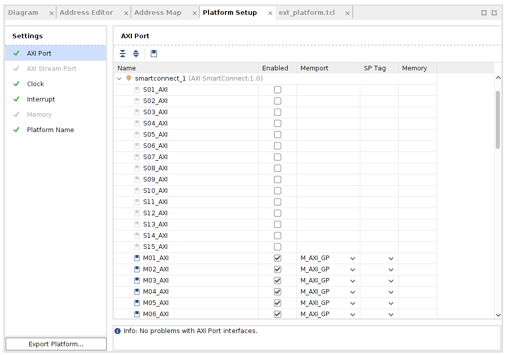
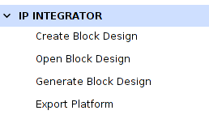

<!-- 
# Copyright 2020 Xilinx Inc.
# 
# Licensed under the Apache License, Version 2.0 (the "License");
# you may not use this file except in compliance with the License.
# You may obtain a copy of the License at
#
#     http://www.apache.org/licenses/LICENSE-2.0
#
# Unless required by applicable law or agreed to in writing, software
# distributed under the License is distributed on an "AS IS" BASIS,
# WITHOUT WARRANTIES OR CONDITIONS OF ANY KIND, either express or implied.
# See the License for the specific language governing permissions and
# limitations under the License.
-->


<table width="100%">
 <tr width="100%">
    <td align="center"><h1>Versal Custom Platform Creation Tutorial</h1>
    </td>
 </tr>
</table>

## Step 1: Hardware Settings for Vitis Platform

The Versal Extensible Platform Example has setup the platform properties. We will review these properties in this step.

For a custom board platform, you will need to setup these properties manually. They can be set in GUI or Tcl. We will discuss the setup flow in detail.


### Review the Versal Extensible Platform Example Platform Setup

1. Launch Vivado and open the design we created in step 0 if you haven't

   - Make sure the block design is open. If not, click **Open Block Design** in **Flow Navigator**

2. Export block diagram tcl to cross check the tcl commands

   - Click **File -> Export -> Export Block Diagram**
   - Check the Tcl file location and click **OK**
   - Open the exported tcl file

2. Go to Platform Setup tab. 

   - If it's not open, click menu Window -> Platform Setup to open it.

3. Review the AXI port settings

   - In axi_noc_ddr4, S01_AXI to S27_AXI are enabled. **SP Tag** is set to **DDR**

   

   The corresponding setting in tcl is

   ```tcl
   set_property PFM.AXI_PORT {S00_AXI {memport "S_AXI_NOC" sptag "DDR"} S01_AXI {memport "S_AXI_NOC" sptag "DDR"} S02_AXI {memport "S_AXI_NOC" sptag "DDR"} S03_AXI {memport "S_AXI_NOC" sptag "DDR"} S04_AXI {memport "S_AXI_NOC" sptag "DDR"} S05_AXI {memport "S_AXI_NOC" sptag "DDR"} S06_AXI {memport "S_AXI_NOC" sptag "DDR"} S07_AXI {memport "S_AXI_NOC" sptag "DDR"} S08_AXI {memport "S_AXI_NOC" sptag "DDR"} S09_AXI {memport "S_AXI_NOC" sptag "DDR"} S10_AXI {memport "S_AXI_NOC" sptag "DDR"} S11_AXI {memport "S_AXI_NOC" sptag "DDR"} S12_AXI {memport "S_AXI_NOC" sptag "DDR"} S13_AXI {memport "S_AXI_NOC" sptag "DDR"} S14_AXI {memport "S_AXI_NOC" sptag "DDR"} S15_AXI {memport "S_AXI_NOC" sptag "DDR"} S16_AXI {memport "S_AXI_NOC" sptag "DDR"} S17_AXI {memport "S_AXI_NOC" sptag "DDR"} S18_AXI {memport "S_AXI_NOC" sptag "DDR"} S19_AXI {memport "S_AXI_NOC" sptag "DDR"} S20_AXI {memport "S_AXI_NOC" sptag "DDR"} S21_AXI {memport "S_AXI_NOC" sptag "DDR"} S22_AXI {memport "S_AXI_NOC" sptag "DDR"} S23_AXI {memport "S_AXI_NOC" sptag "DDR"} S24_AXI {memport "S_AXI_NOC" sptag "DDR"} S25_AXI {memport "S_AXI_NOC" sptag "DDR"} S26_AXI {memport "S_AXI_NOC" sptag "DDR"} S27_AXI {memport "S_AXI_NOC" sptag "DDR"}} [get_bd_cells /axi_noc_ddr4]
   ```

   **Note**: Vitis emulation automation scriopts require that AXI slave interfaces on Versal platforms to have SP Tag as either **DDR** or **LPDDR**. 

   **Note**: It's a GUI display issue that memport property **S_AXI_NOC** will be displayed as **MIG**. Please use S_AXI_NOC if you'd like to enable more AXI Slave ports.

   - In smartconnect_1, M01_AXI to M15_AXI are enabled. Memport is set to M_AXI_GP. SP Tag is empty. These ports are used to control PL kernels.

   

   The corresponding setting in tcl is

   ```tcl
   set_property PFM.AXI_PORT {M01_AXI {memport "M_AXI_GP" sptag "" memory ""} M02_AXI {memport "M_AXI_GP" sptag "" memory ""} M03_AXI {memport "M_AXI_GP" sptag "" memory ""} M04_AXI {memport "M_AXI_GP" sptag "" memory ""} M05_AXI {memport "M_AXI_GP" sptag "" memory ""} M06_AXI {memport "M_AXI_GP" sptag "" memory ""} M07_AXI {memport "M_AXI_GP" sptag "" memory ""} M08_AXI {memport "M_AXI_GP" sptag "" memory ""} M09_AXI {memport "M_AXI_GP" sptag "" memory ""} M10_AXI {memport "M_AXI_GP" sptag "" memory ""} M11_AXI {memport "M_AXI_GP" sptag "" memory ""} M12_AXI {memport "M_AXI_GP" sptag "" memory ""} M13_AXI {memport "M_AXI_GP" sptag "" memory ""} M14_AXI {memport "M_AXI_GP" sptag "" memory ""} M15_AXI {memport "M_AXI_GP" sptag "" memory ""}} [get_bd_cells /smartconnect_1]
   ```

   **Note**: SP Tag for AXI Master doesn't take effect.

4. Review the Clock settings

   - In Clock tab, clk_out1, clk_out2, clk_out3 from clk_wizard_0 are enabled with id {1,0,2}, frequency {99.999MHz, 149.999MHz, 299.999MHz}.
   - clk_out2 is the default clock. V++ linker will use this clock to connect the kernel if link configuration doesn't specify any clocks.
   - The Proc Sys Reset property is set to the synchronous reset signal assosiated with this clock.

   

   The corresponding setting in tcl is

   ```tcl
   set_property PFM.CLOCK {clk_out1 {id "1" is_default "false" proc_sys_reset "proc_sys_reset_0" status "fixed"} clk_out2 {id "0" is_default "true" proc_sys_reset "/proc_sys_reset_1" status "fixed"} clk_out3 {id "2" is_default "false" proc_sys_reset "/proc_sys_reset_2" status "fixed"}} [get_bd_cells /clk_wizard_0]
   ```


5. Review the Interrupt Tab

   - In Interrupt tab, intr port of axi_intc_0 is enabled.

   

   The corresponding setting in tcl is

   ```tcl
   set_property PFM.IRQ {intr {id 0 range 32}} [get_bd_cells /axi_intc_0]
   ```


### Review the Simulation Model

The Versal Extensible Platform Example has setup the similation model of each IP properly. We will review the settings in this session. If you created the block design by yourself, please make sure these settings are applied before running emulation on your platform.

Some blocks in the block design has multiple types of simulation models. Vitis emulation requires these blocks to use SystemC TLM (Transaction-level Modeling) model when available. TLM is the default simulation model for CIPS, NOC and AI Engine in Vivado 2020.2. We can review them to make sure they are correct before exporting the hardware.

1. Review CIPS simulation model settings

   - In Vivado GUI, select the CIPS instance
   - Check the ***Block Properties*** window
   - In ***Properties*** tab, it shows **ALLOWED_SIM_MODELS** is `tlm,rtl`, **SELECTED_SIM_MODEL** is `tlm`. It means this block supports two simulation models. We selected to use `tlm` model.

   

2. Review the simulation model property for NOC and AI Engine in the block diagram.


### Export Hardware XSA


1. Generate Block Diagram

   - Click **Generate Block Diagram** from Flow Navigator window

   

   - Select **Synthesis Options** to **Global** to save generation time. 

   

   - Click **Generate** button

   Note: Synthesis default option **Out of context per IP** will synthesize each IP in the block diagram. Since we will use pre-synthesis XSA in next steps, we don't need to synthesize these IPs.

   Note: It's safe to ignore this critical warning. Vitis will connect this signal in the future.

   


2. Export platform with the following scripts

   - Click **File -> Export -> Export Platform**. Alternative ways are: **Flow Navigator** window: **IP Integrator -> Export Platform**, or the **Export Platform** button on the bottom of **Platform Setup** tab.
   - Click Next on Export Hardware Platform page
   - Select **Hardware and Hardware Emulation**, because there are no un-simulatable IP in the Vivado design. Click Next
   - Select **Pre-synthesis**, because we're not making an DFX platform. Click Next
   - Input Name: **VCK190_Custom_Platform**, click Next
   - Update file name to **vck190_custom**, click Next.
   - Review the summary. Click Finish


   The export step can be done with the following commands as well.

   ```tcl
   # Setting platform properties
   set_property pfm_name {xilinx:vck190_es:VCK190_Custom_Platform:0.0} [get_files -norecurse *.bd]
   # Platform properties are set by Platform Setup GUI. If you haven't used Platform Setup GUI, please setup these properties manually.
   set_property platform.default_output_type "sd_card" [current_project]
   set_property platform.design_intent.embedded "true" [current_project]
   set_property platform.design_intent.server_managed "false" [current_project]
   set_property platform.design_intent.external_host "false" [current_project]
   set_property platform.design_intent.datacenter "false" [current_project]
   # Export Expandable XSA with PDI
   write_hw_platform -force ./vck190_custom.xsa
   ```

***Now we finish the Hardware platform creation flow, then we should go to the [Step2: Software platform creation](./step2.md)***


   

## References

[AR# 72033: How do I add boards and example designs to my Vivado environment?](https://www.xilinx.com/support/answers/72033.html)

<p align="center"><sup>Copyright&copy; 2020 Xilinx</sup></p>
