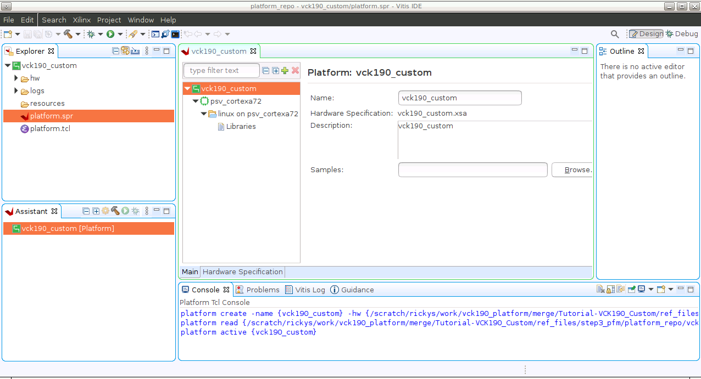
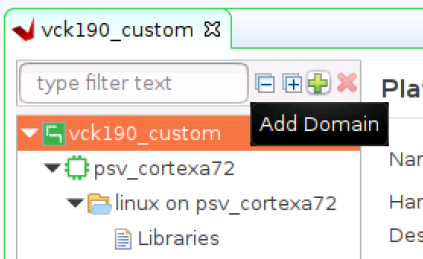
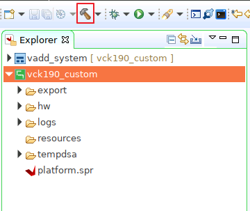

<!-- 
# Copyright 2020 Xilinx Inc.
# 
# Licensed under the Apache License, Version 2.0 (the "License");
# you may not use this file except in compliance with the License.
# You may obtain a copy of the License at
#
#     http://www.apache.org/licenses/LICENSE-2.0
#
# Unless required by applicable law or agreed to in writing, software
# distributed under the License is distributed on an "AS IS" BASIS,
# WITHOUT WARRANTIES OR CONDITIONS OF ANY KIND, either express or implied.
# See the License for the specific language governing permissions and
# limitations under the License.
-->


<table width="100%">
 <tr width="100%">
    <td align="center"><h1>Versal Custom Platform Creation Tutorial</h1>
    </td>
 </tr>
</table>

## Step 3: Create the Vitis Platform

Vitis Platform can be created with Vitis GUI or XSCT command line. This tutorial will focus on GUI flow.

### Prepare for Platform Packaging

We would store all the necessary files in one directory for Vitis platform creation flow. 

| Component                          | Conventional Path or Filename                           | Description                                                  |
| ---------------------------------- | ------------------------------------------------------- | ------------------------------------------------------------ |
| BIF file                           | boot/linux.bif                                          | Boot image generation description file                       |
| Boot components in BOOT.BIN        | boot/bl31.elf</br>boot/u-boot.elf</br>boot/system.dtb   | All components referred in linux.bif should be in this folder |
| Boot components in FAT32 partition | image/boot.scr                                          | U-boot configuration file                                    |

When building a Vitis application, software components like Linux kernel image, root filesystem and sysroot are also needed. So we'll prepare them altogether.

We would store all the necessary files for Vitis platform creation flow. Here we call it **step3_pfm** directory. Example files can be found in **ref_files/step3_pfm** directory of this repository.

1. Add a BIF file (linux.bif) to the **step3_pfm/boot** directory with the contents shown below. The file names should match the contents of the boot directory. 

   ```
   /* linux */
   the_ROM_image:
   {
   { load=0x1000, file=<system.dtb> }
   { load=0x8000000, file=<u-boot.elf> }
   { core=a72-0, exception_level=el-3, trustzone, file=<bl31.elf> }
   }
   ```

2. Make sure all files being referred by **linux.bif** are stored in the same directory. They are generated by PetaLinux and originally located in **<your_petalinux_dir>/images/linux** directory. You can copy them into **step3_pfm/boot** for easy understanding. Here we keep them in **<your_petalinux_dir>/images/linux** directory because in case we need to update PetaLinux settings and rebuilt PetaLinux, we just need to clean platform and rebuilt them in Vitis to generate a new platform. We won't need to copy them manually every time. These files are the source of creating final BOOT.BIN during application packaging. When creating the platform, these files will be copied to the platform output directory. In this example, these files are referred by the BIF file.

   - bl31.elf
   - u-boot.elf
   - system.dtb

3. Prepare **step3_pfm/image** directory. Contents in this directory will be packaged to FAT32 partition of SD card image by v++ package tool.

   - Copy **boot.scr** from **<your_petalinux_dir>/images/linux directory** to the **step3_pfm/image** directory. It's a script for u-boot initialization. U-boot will read it from fat32 partition during boot process.

4. Prepare software components for application creation. Platform packaging can add them or exclude them. Due to the software component size, they are usually kept outside of platforms so that these components can be reused among multiple platforms with the same architecture.

   ```bash
   # Create sw_comp directory
   cd step3_pfm
   mkdir sw_comp
   cd sw_comp
   # Copy Linux kernel image
   cp <your_petalinux_dir>/images/linux/Image .
   # Copy EXT4 Root Filesystem
   cp <your_petalinux_dir>/images/linux/rootfs.ext4 .
   # Install sysroot to this directory
   <your_petalinux_dir>/images/linux/sdk.sh -d ./ -y
   ```

### Platform Packaging

First we create a **Vitis platform project** with the **XSA file** generated by Vivado

1. Launch Vitis.

   ```bash
   source <Vitis_Install_Directory>/settings64.sh
   cd pfm
   vitis -workspace ./platform_repo &
   ```

2. Create a platform project

   - In the Vitis IDE, select **File > New > Platform Project** to create a platform project.
   - Enter the project name. For this example, type ```vck190_custom```, click **Next**.
   - In the Platform page, click **Browse** button, select the XSA file generated by the Vivado. In this case, it is located in `vivado/vck190_custom.xsa`. Click Next.
   - Set the operating system to **linux**.
   - Set the processor to **psv_cortexa72**.
   - Click **Finish**.

   

3. Setup Linux domain settings in Platform Settings view.

   - Click the **linux on psv_cortexa72** domain
   - Set **Bif file**: Browse to **step3_pfm/boot/linux.bif** file and click OK.
   - **Boot Components Directory**: Browse to **step3_pfm/boot/** and click OK.
   - **Linux Image Directory**: Browse to **step3_pfm/image** and click OK.

   **Note**: **Linux Rootfs** and **Sysroot Directory** are optional. They can be provided in either platform or application. We will add them in application creation phase. It will make them easy to be reused among multiple platforms. 

4. (Optional) Setup Linux domain emulation settings

   - Check the settings of QEMU Arguments and PMC QEMU Arguments are set to the files in Vitis installation directory. These default settings can be used. If you need to update the arguments, you can copy them to local, update and setup the new path in the Linux domain configuration.
   - Change QEMU Data to **step3_pfm/boot** directory.

5. Add AI Engine domain

   - Click Add domain icon

   

   - Set Name to aiengine
   - Change OS to **aie_runtime**. 
   - Keep other settings to default and click **OK**.

   

   Note: Vitis IDE and XSCT will add QEMU arguments for AI Engine domain automatically.

6.  Click **vck190_custom** project in the Vitis Explorer view, click the **Build** button to generate the platform.

   


**Note: The generated platform is placed in the export directory. BSP and source files are also provided for re-building the FSBL and PMU if desired and are associated with the platform. The platform is ready to be used for application development.**

   


### Fast Track

Scripts are provided to package the Vitis platform.

To use these scripts, please run the following steps.

1. Run build

   ```
   # cd to the step directory, e.g.
   cd step3_pfm
   make
   ```

2. To clean the generated files, please run

   ```bash
   make clean
   ```

**[Next let's move to step 4 to try to build some applications on this platform and test them.](./step4.md)**

<p align="center"><sup>Copyright&copy; 2020 Xilinx</sup></p>
